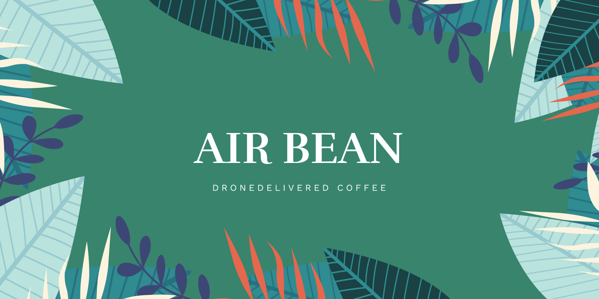

# Team Project - Arbeta Agilt

## Airbean
Ni har anlitats av den världsberömda cafékedjan Airbean, som är mest kända för sitt innovativa sätt att leverera kaffe på, för att utveckla deras nya applikation från grunden.

## Instruktioner

### Övergripande
För denna uppgift behöver ni dels skapa ett gemensamt repo inom teamet, men även ett eget privat repo per teammedlem. Det är detta privata repo som ni var och en lämnar in, och det skall endast innehålla filerna i mappen "individuell inlämning" som ni flyttar över och fyller i. (Dubbelkolla så att ni verkligen gör ert individuella repo privat, detta är JÄTTEVIKTIGT!)

* Ert gemensamma repo döper ni till ert gruppnamn som camelCase följt av Agile (exempelvis superWarriorsAgile)
* Ert privata repo döper ni till ert eget namn i camelCase följt av Agile (exempelvis jesperNybergAgile)
* Ni skapar ett projekt som använder för planering ex Github Projects, Trello, Jira etc.
* Ni behöver göra mig till collaborator i båda era repon, samt ert projekt (Santosnr6).
* I ert gemensamma repo finns en mapp innehållandes lathundar för era olika möten. Dessa skall ni kopiera för varje möte och fylla i enligt instruktioner. Döp varje protokoll enligt principen (dailyscrum240310, planning 240309, review240317, retrospective240320 osv).

### Arbetssätt
Arbetet kommer att simulera en komprimerad variant av scrum där ni under de kommande 2 veckorna kommer att arbeta i 2 sprintar. 
Varje sprint skall bestå av:
* En Sprint Planning varje måndag
* Daily Scrum varje dag ni inte har ett annat möte (alltså tisdag, onsdag och torsdag)
* En Sprint Review varje fredag
* En Sprint Retrospective varje fredag

Under var och ett av dessa möten SKALL kameran vara påslagen! Håll dessa möten över Teams eller Google Meet förslagsvis så kan man följa med i telefonen om man inte har någon webbkamera på datorn, då är det även lätt att skicka ut mötesinbjudningar. 

#### Sprint Planning
Under ert första Sprint Planning så skall ni inom teamet skapa user stories (med korrekt syntax) för varje feature, samt skriva ner vilka acceptanskriterier som finns. Därefter utövar ni agil estimering på era user stories för att rangordna vilka som är mest "prisvärda". Välj sedan ut vilka user stories ni räknar med att kunna lösa under er sprint. Innan ni sätter igång och arbetar så skall ni be om en snabb handledning med mig så att jag som produktägare kan kontrollera att det inte ser helt galet ut. Under er andra sprint planning så utövar ni backlog refinement på er product backlog, innan ni väljer ut vad ni skall arbeta med under kommande sprint.

#### Daily Scrum
Dessa möten skall hållas varje tisdag, onsdag och torsdag, de får pågå i max 15 minuter, inte visa någon kod.

#### Sprint Review
Inför varje fredag kommer ni att kunna boka in en tid med mig under förmiddagen där ni helt enkelt får 15 minuter på er att presentera vad ni åstadkommit. Detta skall vara ett väldigt formellt möte och ni behöver inte läsa någon power point etc. Ni förväntas demonstrera ert inkrement. Ni kan boka in er Sprint Review [genom att klicka här](https://docs.google.com/document/d/1H_Pjm0BVmw7EPng_f3PCmG-zmxDvCf9rSttRFnD-cYY/edit?usp=sharing).

#### Sprint Retrospective
Efter er Sprint Review samlas ni i ett mötesrum och diskuterar den gångna sprinten.

### Krav från Kund
* Det skall finnas en Landnings-sida
* Det skall finnas en Produkt-sida
* Det skall finnas en Om Oss-sida
* Det skall finnas en Order-sida
* Det skall finnas en Status-sida (se mockup)
* Det skall finnas en Profil-sida
* Det skall finnas en Logga In / Registreringssida
* Ni behöver läsa in produkterna från ett API
* Ni behöver implementera varukorgens funktionalitet
* Ni behöver generera unika ordernummer för varje order
* Ni behöver spara inloggade kunders orderhistorik
* Ni behöver implementera en Lazy Loader vid API-anrop (lägg gärna på en medveten fördröjning så att denna syns) 
* Ni behöver implementera funktionalitet för att logga in
* Ni behöver implementera funktionalitet för att välja om man loggar in som kund eller admin
* Ni behöver implementera funktionalitet för att registrera ny kund
* Ni behöver implementera funktionalitet för Profil-sidan (ex ändra lösenord, profilbild, se orderhistorik etc)
* Ni behöver designa en desktop-variant av appen
* Ni behöver styla om responsivt för desktop (Alla storlekar)
* Ni behöver hålla menyn uppdaterad (vad visar vi beroende på vem som är in/utloggad)
* Ni behöver implementera funktionalitet för att admin skall kunna uppdatera, lägga till, ta bort produkter. (Läs hem från APIet och tryck in i local/sessionstorage för att lösa detta)
* Ni behöver säkerställa tillgänglighet
* Ni behöver beräkna ut hur lång tid det tar för en drönare att leverera en order, samt presentera detta

Ni får även lägga till egna features, men då måste ni kolla med produktägaren (Jesper) först så att han anser att detta fyller ett värde hos sitt företag.

### Resurser

#### Figmaskiss

https://www.figma.com/file/UeUGVefSdgio0sRxPFccJI/AirBean-v.1.0?node-id=0%3A1

#### Produkter

https://santosnr6.github.io/Data/airbeanproducts.json

#### Användare

https://santosnr6.github.io/Data/airbeanusers.json

## Examination
Notera att det inte är slutresultatet av ert projekt som är betygsgrundande i denna examination, utan snarare vad ni lär er under projektets gång, samt hur väl ni reflekterar över projektet och det arbete ni utför.

### Kravspecifikation

#### För att få Godkänt skall ni
* Arbeta agilt med Scrum
* Använda er av Github Projects / Trello / Jira
* Delta aktivt i teamets arbete
* Be om hjälp i gruppen om ni behöver det. Det är INTE okej att sitta med en feature i 3-4 dagar utan att komma någonvart.
* Delta i minst 10 av 12 möten, med kameran PÅSLAGEN (giltig frånvaro är naturligtvis okej, men då behöver man meddela både gruppen OCH mig för godkännande)
* Fylla i ALLA mötesprotokoll
* Svara på alla frågor i gruppreflektionen (minst 80 tecken per svar)
* Svara på alla frågor i den individuella reflektionen (minst 80 tecken per svar)
* Kunna presentera någonting som fungerar efter varje sprint

#### För att få Väl Godkänt skall ni
* Svara reflekterande på VG-frågorna i den individuella reflektionen

### Inlämning
Ni laddar upp ert PRIVATA repo på Azomo senast kl 23:59 söndagen den 24e mars.
